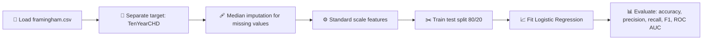

<div align="center">

# ❤️ Heart Disease Prediction using Logistic Regression

### Predicting 10 year coronary heart disease risk from the Framingham Heart Study dataset

[](https://www.python.org/)
[](https://scikit-learn.org/)
[](https://pandas.pydata.org/)

</div>

---

## 📌 Overview

This project builds a **Logistic Regression** model to predict whether a patient will develop **coronary heart disease (CHD) within 10 years**, using the well known **Framingham Heart Study** dataset.

The focus here is a clean, no frills classical machine learning pipeline, proper missing value handling, feature scaling, and a full evaluation suite covering accuracy, precision, recall, F1, and ROC AUC rather than just a single accuracy number.

---

## 🧠 How It Works



---

## 🗂️ Dataset

The **Framingham Heart Study** dataset is a long running cardiovascular study dataset, widely used as a benchmark for heart disease risk prediction.

* 🎯 **Target column:** `TenYearCHD`, a binary label indicating whether the patient developed CHD within 10 years
* 🧾 **Features** include demographic, behavioral, and medical risk factors such as age, sex, smoking habits, blood pressure, cholesterol, glucose, and BMI
* ⚠️ The dataset contains missing values in several columns, which is handled directly in the pipeline

> 📁 The script expects a file named `framingham.csv` in the same directory. This dataset is publicly available and is **not included** in this repository.

---

## ⚙️ Pipeline Details

| Step | What Happens |
|---|---|
| 🩹 **Missing values** | Imputed using the **median** strategy via `SimpleImputer` |
| ⚖️ **Feature scaling** | All features standardized using `StandardScaler` |
| ✂️ **Train/test split** | 80% train, 20% test, with `random_state=42` for reproducibility |
| 📈 **Model** | `LogisticRegression` with `max_iter=1000` |

---

## 🛠️ Tech Stack

<div align="center">

| Category | Tools Used |
|---|---|
| 🐍 Language | Python 3 |
| 🤖 Machine Learning | scikit learn (`LogisticRegression`) |
| 📊 Data Handling | Pandas |
| 🩹 Preprocessing | `SimpleImputer`, `StandardScaler` |
| 📏 Evaluation | Accuracy, Precision, Recall, F1, ROC AUC, Classification Report |

</div>

---

## 📊 Evaluation Metrics

The script evaluates the trained model using:

* ✅ **Accuracy**
* 🎯 **Precision**
* 🔁 **Recall**
* ⚖️ **F1 Score**
* 📈 **ROC AUC**
* 📋 Full **classification report** broken down by class

> 📝 Actual metric values depend on the dataset used at runtime and are printed directly to the console when the script is run. Run it locally to see your own results.

---

## 📁 Project Structure

```
heart-disease-prediction/
│
├── heart_disease_prediction.py   # Main script: load, preprocess, train, evaluate
├── framingham.csv                # Dataset (not included, add your own copy)
└── README.md                     # You are here
```

---

## ▶️ Getting Started

1. **Clone the repository**
   ```bash
   git clone https://github.com/sarthakNaikare/heart-disease-prediction.git
   cd heart-disease-prediction
   ```

2. **Install dependencies**
   ```bash
   pip install pandas scikit-learn
   ```

3. **Add the dataset**
   Place `framingham.csv` in the same folder as the script. The dataset is publicly available from standard Framingham Heart Study sources.

4. **Run the script**
   ```bash
   python heart_disease_prediction.py
   ```

   The console will print the dataset shape, a preview of the data, and the full set of evaluation metrics.

---

## 🔮 Future Improvements

* 🌲 Compare against tree based models like Random Forest or XGBoost
* 🎛️ Add hyperparameter tuning via `GridSearchCV`
* 🧪 Add cross validation instead of a single train test split
* 📉 Visualize the ROC curve and confusion matrix
* ⚖️ Handle class imbalance, since CHD positive cases are typically a minority class

---

<div align="center">

### 👤 Author

**Swapnil Yadav**

⭐ If you found this project useful or interesting, consider giving it a star!

</div>
